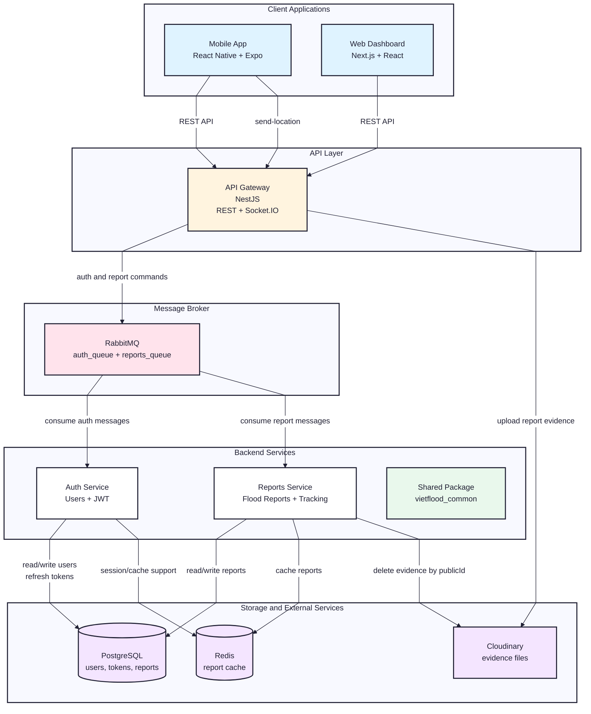

```mermaid
%%{init: {
  "theme": "base",
  "themeVariables": {
    "background": "#ffffff",
    "primaryColor": "#ffffff",
    "primaryTextColor": "#202033",
    "primaryBorderColor": "#202033",
    "lineColor": "#202033",
    "fontSize": "15px",
    "fontFamily": "Inter, Arial, sans-serif"
  },
  "flowchart": {
    "useMaxWidth": true,
    "htmlLabels": true,
    "curve": "linear",
    "padding": 28,
    "nodeSpacing": 60,
    "rankSpacing": 80
  }
}}%%

flowchart TD

    %% Clients
    subgraph ClientLayer["Client Applications"]
        direction LR
        Mobile["Mobile App<br/>React Native + Expo"]
        Web["Web Dashboard<br/>Next.js + React"]
    end

    %% Public backend entry point
    subgraph GatewayLayer["API Layer"]
        direction TB
        Gateway["API Gateway<br/>NestJS<br/>REST + Socket.IO"]
    end

    %% Queue
    subgraph QueueLayer["Message Broker"]
        direction TB
        RabbitMQ["RabbitMQ<br/>auth_queue + reports_queue"]
    end

    %% Internal services
    subgraph ServiceLayer["Backend Services"]
        direction LR
        Auth["Auth Service<br/>Users + JWT"]
        Reports["Reports Service<br/>Flood Reports + Tracking"]
        Common["Shared Package<br/>vietflood_common"]
    end

    %% Storage and external systems
    subgraph DataLayer["Storage and External Services"]
        direction LR
        PostgreSQL[("PostgreSQL<br/>users, tokens, reports")]
        Redis[("Redis<br/>report cache")]
        Cloudinary["Cloudinary<br/>evidence files"]
    end

    %% Main request flow
    Mobile -->|REST API| Gateway
    Web -->|REST API| Gateway
    Mobile -->|send-location| Gateway

    %% Service message flow
    Gateway -->|auth and report commands| RabbitMQ
    RabbitMQ -->|consume auth messages| Auth
    RabbitMQ -->|consume report messages| Reports

    %% Data flow
    Auth -->|read/write users<br/>refresh tokens| PostgreSQL
    Auth -->|session/cache support| Redis

    Reports -->|read/write reports| PostgreSQL
    Reports -->|cache reports| Redis

    %% Evidence flow
    Gateway -->|upload report evidence| Cloudinary
    Reports -->|delete evidence by publicId| Cloudinary

    %% Styles
    classDef client fill:#dff3ff,stroke:#202033,stroke-width:2px,color:#202033;
    classDef api fill:#fff4df,stroke:#202033,stroke-width:2px,color:#202033;
    classDef queue fill:#ffe3ec,stroke:#202033,stroke-width:2px,color:#202033;
    classDef service fill:#ffffff,stroke:#202033,stroke-width:2px,color:#202033;
    classDef data fill:#f4e5ff,stroke:#202033,stroke-width:2px,color:#202033;
    classDef shared fill:#e9f8ec,stroke:#202033,stroke-width:2px,color:#202033;

    class Mobile,Web client;
    class Gateway api;
    class RabbitMQ queue;
    class Auth,Reports service;
    class PostgreSQL,Redis,Cloudinary data;
    class Common shared;

    style ClientLayer fill:#f8f9ff,stroke:#202033,stroke-width:2px,color:#202033;
    style GatewayLayer fill:#f8f9ff,stroke:#202033,stroke-width:2px,color:#202033;
    style QueueLayer fill:#f8f9ff,stroke:#202033,stroke-width:2px,color:#202033;
    style ServiceLayer fill:#f8f9ff,stroke:#202033,stroke-width:2px,color:#202033;
    style DataLayer fill:#f8f9ff,stroke:#202033,stroke-width:2px,color:#202033;
```
