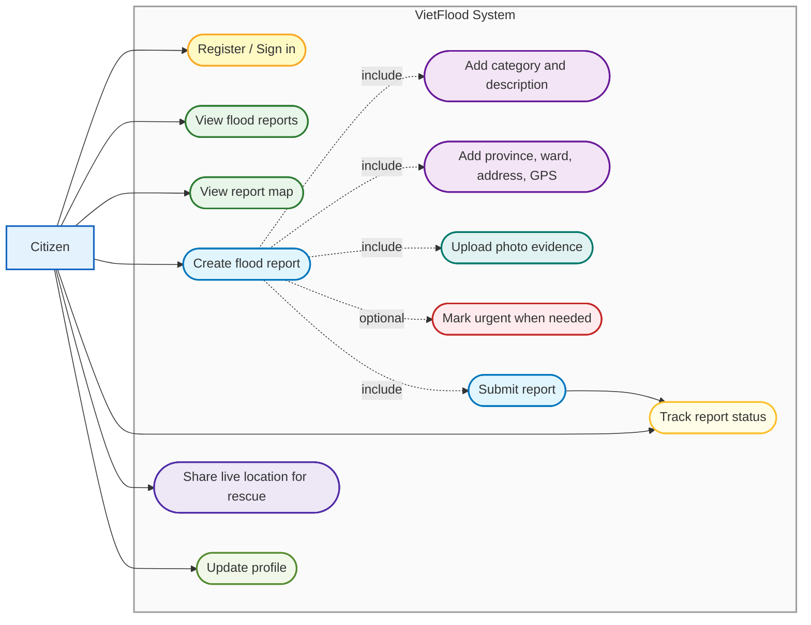

```mermaid
flowchart LR

    Citizen["Citizen"]

    subgraph VietFlood["VietFlood System"]
        SignIn([Register / Sign in])
        ViewReports([View flood reports])
        ViewMap([View report map])
        CreateReport([Create flood report])
        AddDetails([Add category and description])
        AddLocation([Add province, ward, address, GPS])
        UploadEvidence([Upload photo evidence])
        MarkUrgent([Mark urgent when needed])
        SubmitReport([Submit report])
        TrackStatus([Track report status])
        ShareLocation([Share live location for rescue])
        UpdateProfile([Update profile])
    end

    Citizen --> SignIn
    Citizen --> ViewReports
    Citizen --> ViewMap
    Citizen --> CreateReport
    Citizen --> TrackStatus
    Citizen --> ShareLocation
    Citizen --> UpdateProfile

    CreateReport -. "include" .-> AddDetails
    CreateReport -. "include" .-> AddLocation
    CreateReport -. "include" .-> UploadEvidence
    CreateReport -. "optional" .-> MarkUrgent
    CreateReport -. "include" .-> SubmitReport
    SubmitReport --> TrackStatus

    style Citizen fill:#e3f2fd,stroke:#1565c0,stroke-width:2px
    style VietFlood fill:#fafafa,stroke:#9e9e9e,stroke-width:2px
    style SignIn fill:#fff9c4,stroke:#f9a825,stroke-width:2px
    style ViewReports fill:#e8f5e9,stroke:#2e7d32,stroke-width:2px
    style ViewMap fill:#e8f5e9,stroke:#2e7d32,stroke-width:2px
    style CreateReport fill:#e1f5fe,stroke:#0277bd,stroke-width:2px
    style AddDetails fill:#f3e5f5,stroke:#6a1b9a,stroke-width:2px
    style AddLocation fill:#f3e5f5,stroke:#6a1b9a,stroke-width:2px
    style UploadEvidence fill:#e0f2f1,stroke:#00796b,stroke-width:2px
    style MarkUrgent fill:#ffebee,stroke:#c62828,stroke-width:2px
    style SubmitReport fill:#e1f5fe,stroke:#0277bd,stroke-width:2px
    style TrackStatus fill:#fffde7,stroke:#fbc02d,stroke-width:2px
    style ShareLocation fill:#ede7f6,stroke:#512da8,stroke-width:2px
    style UpdateProfile fill:#f1f8e9,stroke:#558b2f,stroke-width:2px
```
