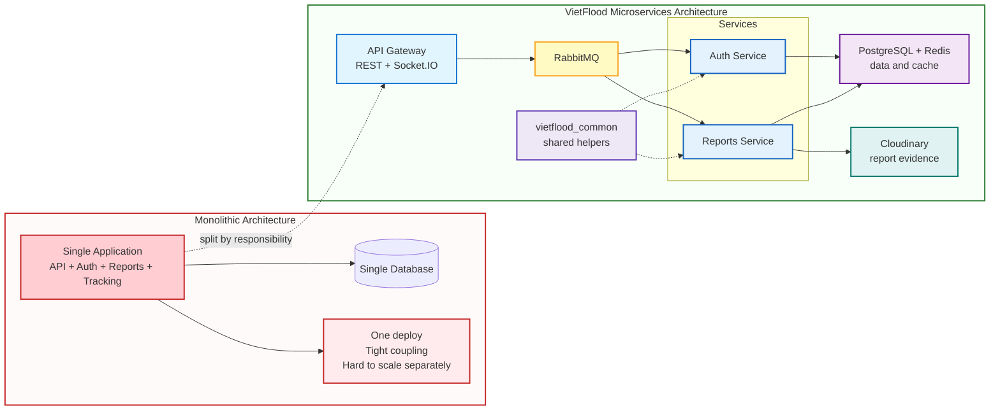

```mermaid
flowchart LR

    subgraph Mono["Monolithic Architecture"]
        direction TB
        MonoApp["Single Application<br/>API + Auth + Reports + Tracking"]
        MonoDB[("Single Database")]
        MonoLimit["One deploy<br/>Tight coupling<br/>Hard to scale separately"]

        MonoApp --> MonoDB
        MonoApp --> MonoLimit
    end

    subgraph Micro["VietFlood Microservices Architecture"]
        direction TB
        Gateway["API Gateway<br/>REST + Socket.IO"]
        Broker["RabbitMQ"]

        subgraph Services["Services"]
            direction LR
            Auth["Auth Service"]
            Reports["Reports Service"]
        end

        Storage["PostgreSQL + Redis<br/>data and cache"]
        Media["Cloudinary<br/>report evidence"]
        Common["vietflood_common<br/>shared helpers"]

        Gateway --> Broker
        Broker --> Auth
        Broker --> Reports
        Auth --> Storage
        Reports --> Storage
        Reports --> Media
        Common -.-> Auth
        Common -.-> Reports
    end

    MonoApp -.->|"split by responsibility"| Gateway

    style Mono fill:#fffafa,stroke:#c62828,stroke-width:2px
    style Micro fill:#f8fff8,stroke:#2e7d32,stroke-width:2px
    style MonoApp fill:#ffcdd2,stroke:#c62828,stroke-width:2px
    style MonoLimit fill:#ffebee,stroke:#c62828,stroke-width:2px
    style Gateway fill:#e1f5ff,stroke:#1976d2,stroke-width:2px
    style Broker fill:#fff9c4,stroke:#f9a825,stroke-width:2px
    style Auth fill:#e3f2fd,stroke:#1565c0,stroke-width:2px
    style Reports fill:#e3f2fd,stroke:#1565c0,stroke-width:2px
    style Storage fill:#f3e5f5,stroke:#6a1b9a,stroke-width:2px
    style Media fill:#e0f2f1,stroke:#00796b,stroke-width:2px
    style Common fill:#ede7f6,stroke:#5e35b1,stroke-width:2px
```
