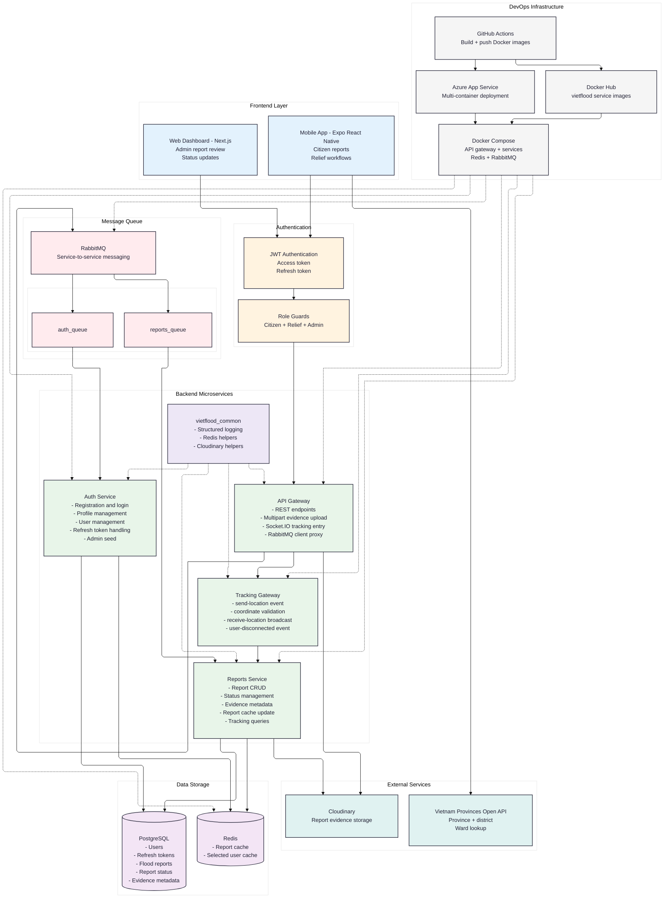

```mermaid
%%{init: {
  "theme": "base",
  "layout": "elk",
  "themeVariables": {
    "background": "#ffffff",
    "primaryColor": "#ffffff",
    "primaryTextColor": "#202033",
    "primaryBorderColor": "#202033",
    "lineColor": "#111111",
    "fontSize": "15px",
    "fontFamily": "Inter, Arial, sans-serif"
  },
  "flowchart": {
    "useMaxWidth": true,
    "htmlLabels": true,
    "curve": "linear",
    "padding": 35,
    "nodeSpacing": 85,
    "rankSpacing": 95
  }
}}%%

graph TD

    %% =========================
    %% DEVOPS LAYER
    %% =========================
    subgraph DEVOPS["DevOps Infrastructure"]
        direction TB
        GITHUB_ACTIONS["GitHub Actions<br/>Build + push Docker images"]
        DOCKER["Docker Compose<br/>API gateway + services<br/>Redis + RabbitMQ"]
        DOCKER_HUB["Docker Hub<br/>vietflood service images"]
        AZURE["Azure App Service<br/>Multi-container deployment"]
    end

    %% =========================
    %% FRONTEND LAYER
    %% =========================
    subgraph FRONTEND["Frontend Layer"]
        direction LR
        WEB["Web Dashboard - Next.js<br/>Admin report review<br/>Status updates"]
        MOBILE["Mobile App - Expo React Native<br/>Citizen reports<br/>Relief workflows"]
    end

    %% =========================
    %% AUTHENTICATION
    %% =========================
    subgraph AUTH["Authentication"]
        direction TB
        JWT["JWT Authentication<br/>Access token<br/>Refresh token"]
        ROLE["Role Guards<br/>Citizen + Relief + Admin"]
    end

    %% =========================
    %% MESSAGE QUEUE
    %% =========================
    subgraph MQ["Message Queue"]
        direction TB
        RABBITMQ["RabbitMQ<br/>Service-to-service messaging"]
        
        subgraph QUEUES[" "]
            direction LR
            AUTH_Q["auth_queue"]
            REPORTS_Q["reports_queue"]
        end
    end

    %% =========================
    %% BACKEND MICROSERVICES
    %% =========================
    subgraph BACKEND["Backend Microservices"]
        direction LR

        API_GW["API Gateway<br/>- REST endpoints<br/>- Multipart evidence upload<br/>- Socket.IO tracking entry<br/>- RabbitMQ client proxy"]

        AUTH_SVC["Auth Service<br/>- Registration and login<br/>- Profile management<br/>- User management<br/>- Refresh token handling<br/>- Admin seed"]

        REPORTS_SVC["Reports Service<br/>- Report CRUD<br/>- Status management<br/>- Evidence metadata<br/>- Report cache update<br/>- Tracking queries"]

        TRACKING_GW["Tracking Gateway<br/>- send-location event<br/>- coordinate validation<br/>- receive-location broadcast<br/>- user-disconnected event"]

        COMMON_LIB["vietflood_common<br/>- Structured logging<br/>- Redis helpers<br/>- Cloudinary helpers"]
    end

    %% =========================
    %% EXTERNAL SERVICES
    %% =========================
    subgraph EXTERNAL["External Services"]
        direction LR
        CLOUDINARY["Cloudinary<br/>Report evidence storage"]
        PROVINCES_API["Vietnam Provinces Open API<br/>Province + district<br/>Ward lookup"]
    end

    %% =========================
    %% DATA STORAGE
    %% =========================
    subgraph DATA["Data Storage"]
        direction LR
        POSTGRES[("PostgreSQL<br/>- Users<br/>- Refresh tokens<br/>- Flood reports<br/>- Report status<br/>- Evidence metadata")]

        REDIS[("Redis<br/>- Report cache<br/>- Selected user cache")]
    end

    %% =========================
    %% MAIN FLOWS
    %% =========================
    WEB --> JWT
    MOBILE --> JWT
    MOBILE --> PROVINCES_API

    JWT --> ROLE
    ROLE --> API_GW

    API_GW --> RABBITMQ
    RABBITMQ --> AUTH_Q
    RABBITMQ --> REPORTS_Q
    AUTH_Q --> AUTH_SVC
    REPORTS_Q --> REPORTS_SVC

    API_GW --> TRACKING_GW
    TRACKING_GW --> REPORTS_SVC

    API_GW --> CLOUDINARY
    REPORTS_SVC --> CLOUDINARY

    AUTH_SVC --> POSTGRES
    REPORTS_SVC --> POSTGRES

    AUTH_SVC --> REDIS
    REPORTS_SVC --> REDIS

    %% =========================
    %% SHARED MODULE FLOWS
    %% =========================
    COMMON_LIB -.-> API_GW
    COMMON_LIB -.-> AUTH_SVC
    COMMON_LIB -.-> REPORTS_SVC
    COMMON_LIB -.-> TRACKING_GW

    %% =========================
    %% DEVOPS FLOWS
    %% =========================
    GITHUB_ACTIONS --> DOCKER_HUB
    GITHUB_ACTIONS --> AZURE
    DOCKER_HUB --> DOCKER
    AZURE --> DOCKER

    DOCKER -.-> API_GW
    DOCKER -.-> AUTH_SVC
    DOCKER -.-> REPORTS_SVC
    DOCKER -.-> TRACKING_GW
    DOCKER -.-> RABBITMQ
    DOCKER -.-> REDIS

    %% =========================
    %% CLASSES
    %% =========================
    classDef frontend fill:#e3f2fd,stroke:#202033,stroke-width:1.4px,color:#202033;
    classDef auth fill:#fff3e0,stroke:#202033,stroke-width:1.4px,color:#202033;
    classDef backend fill:#e8f5e9,stroke:#202033,stroke-width:1.4px,color:#202033;
    classDef shared fill:#ede7f6,stroke:#202033,stroke-width:1.4px,color:#202033;
    classDef mq fill:#ffebee,stroke:#202033,stroke-width:1.4px,color:#202033;
    classDef data fill:#f3e5f5,stroke:#202033,stroke-width:1.4px,color:#202033;
    classDef external fill:#e0f2f1,stroke:#202033,stroke-width:1.4px,color:#202033;
    classDef devops fill:#f5f5f5,stroke:#202033,stroke-width:1.4px,color:#202033;

    class WEB,MOBILE frontend;
    class JWT,ROLE auth;
    class API_GW,AUTH_SVC,REPORTS_SVC,TRACKING_GW backend;
    class COMMON_LIB shared;
    class RABBITMQ,AUTH_Q,REPORTS_Q mq;
    class POSTGRES,REDIS data;
    class CLOUDINARY,PROVINCES_API external;
    class GITHUB_ACTIONS,DOCKER,DOCKER_HUB,AZURE devops;
```
