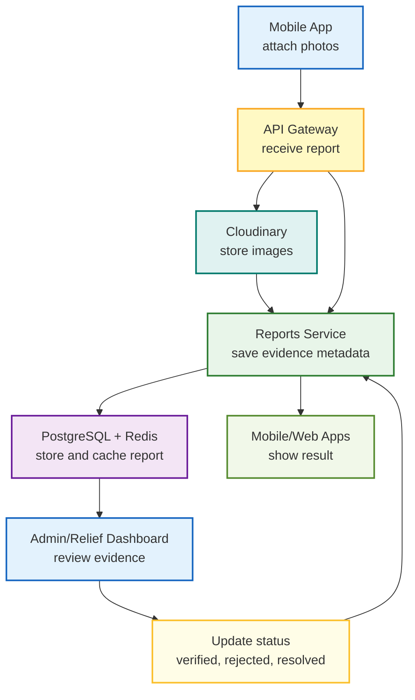

```mermaid
flowchart TD

    Mobile["Mobile App<br/>attach photos"]
    Gateway["API Gateway<br/>receive report"]
    Cloudinary["Cloudinary<br/>store images"]
    Reports["Reports Service<br/>save evidence metadata"]
    Database["PostgreSQL + Redis<br/>store and cache report"]
    Dashboard["Admin/Relief Dashboard<br/>review evidence"]
    Status["Update status<br/>verified, rejected, resolved"]
    Apps["Mobile/Web Apps<br/>show result"]

    Mobile --> Gateway
    Gateway --> Cloudinary
    Cloudinary --> Reports
    Gateway --> Reports
    Reports --> Database
    Database --> Dashboard
    Dashboard --> Status
    Status --> Reports
    Reports --> Apps

    style Mobile fill:#e3f2fd,stroke:#1565c0,stroke-width:2px
    style Gateway fill:#fff9c4,stroke:#f9a825,stroke-width:2px
    style Cloudinary fill:#e0f2f1,stroke:#00796b,stroke-width:2px
    style Reports fill:#e8f5e9,stroke:#2e7d32,stroke-width:2px
    style Database fill:#f3e5f5,stroke:#6a1b9a,stroke-width:2px
    style Dashboard fill:#e3f2fd,stroke:#1565c0,stroke-width:2px
    style Status fill:#fffde7,stroke:#fbc02d,stroke-width:2px
    style Apps fill:#f1f8e9,stroke:#558b2f,stroke-width:2px
```
