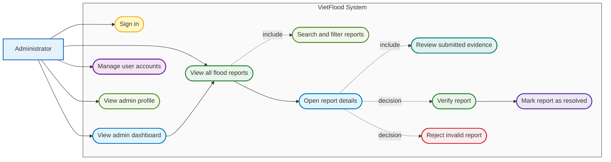

```mermaid
flowchart LR

    Admin["Administrator"]

    subgraph VietFlood["VietFlood System"]
        SignIn([Sign in])
        ViewDashboard([View admin dashboard])
        ViewReports([View all flood reports])
        SearchFilter([Search and filter reports])
        ReviewReport([Open report details])
        ReviewEvidence([Review submitted evidence])
        VerifyReport([Verify report])
        RejectReport([Reject invalid report])
        ResolveReport([Mark report as resolved])
        ManageUsers([Manage user accounts])
        ViewProfile([View admin profile])
    end

    Admin --> SignIn
    Admin --> ViewDashboard
    Admin --> ViewReports
    Admin --> ManageUsers
    Admin --> ViewProfile

    ViewDashboard --> ViewReports
    ViewReports -. "include" .-> SearchFilter
    ViewReports --> ReviewReport
    ReviewReport -. "include" .-> ReviewEvidence
    ReviewReport -. "decision" .-> VerifyReport
    ReviewReport -. "decision" .-> RejectReport
    VerifyReport --> ResolveReport

    style Admin fill:#e3f2fd,stroke:#1565c0,stroke-width:2px
    style VietFlood fill:#fafafa,stroke:#9e9e9e,stroke-width:2px
    style SignIn fill:#fff9c4,stroke:#f9a825,stroke-width:2px
    style ViewDashboard fill:#e1f5fe,stroke:#0277bd,stroke-width:2px
    style ViewReports fill:#e8f5e9,stroke:#2e7d32,stroke-width:2px
    style SearchFilter fill:#f1f8e9,stroke:#558b2f,stroke-width:2px
    style ReviewReport fill:#e1f5fe,stroke:#0277bd,stroke-width:2px
    style ReviewEvidence fill:#e0f2f1,stroke:#00796b,stroke-width:2px
    style VerifyReport fill:#e8f5e9,stroke:#2e7d32,stroke-width:2px
    style RejectReport fill:#ffebee,stroke:#c62828,stroke-width:2px
    style ResolveReport fill:#ede7f6,stroke:#512da8,stroke-width:2px
    style ManageUsers fill:#f3e5f5,stroke:#6a1b9a,stroke-width:2px
    style ViewProfile fill:#f1f8e9,stroke:#558b2f,stroke-width:2px
```
