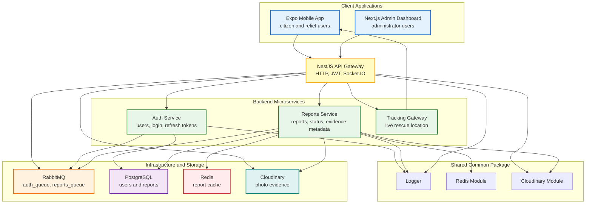

```mermaid
flowchart TD

    subgraph Clients["Client Applications"]
        Mobile["Expo Mobile App<br/>citizen and relief users"]
        Web["Next.js Admin Dashboard<br/>administrator users"]
    end

    Gateway["NestJS API Gateway<br/>HTTP, JWT, Socket.IO"]

    subgraph Services["Backend Microservices"]
        Auth["Auth Service<br/>users, login, refresh tokens"]
        Reports["Reports Service<br/>reports, status, evidence metadata"]
        Tracking["Tracking Gateway<br/>live rescue location"]
    end

    subgraph Shared["Shared Common Package"]
        Logger["Logger"]
        RedisClient["Redis Module"]
        CloudinaryClient["Cloudinary Module"]
    end

    subgraph External["Infrastructure and Storage"]
        RabbitMQ["RabbitMQ<br/>auth_queue, reports_queue"]
        PostgreSQL["PostgreSQL<br/>users and reports"]
        Redis["Redis<br/>report cache"]
        Cloudinary["Cloudinary<br/>photo evidence"]
    end

    Mobile --> Gateway
    Web --> Gateway
    Gateway --> Auth
    Gateway --> Reports
    Gateway --> Tracking
    Gateway --> RabbitMQ
    Auth --> RabbitMQ
    Reports --> RabbitMQ
    Auth --> PostgreSQL
    Reports --> PostgreSQL
    Reports --> Redis
    Gateway --> Cloudinary
    Reports --> Cloudinary
    Tracking --> Mobile
    Auth --> Logger
    Reports --> Logger
    Gateway --> Logger
    Reports --> RedisClient
    Gateway --> CloudinaryClient
    Reports --> CloudinaryClient

    style Mobile fill:#e3f2fd,stroke:#1565c0,stroke-width:2px
    style Web fill:#e3f2fd,stroke:#1565c0,stroke-width:2px
    style Gateway fill:#fff9c4,stroke:#f9a825,stroke-width:2px
    style Auth fill:#e8f5e9,stroke:#2e7d32,stroke-width:2px
    style Reports fill:#e8f5e9,stroke:#2e7d32,stroke-width:2px
    style Tracking fill:#e8f5e9,stroke:#2e7d32,stroke-width:2px
    style RabbitMQ fill:#fff3e0,stroke:#ef6c00,stroke-width:2px
    style PostgreSQL fill:#f3e5f5,stroke:#6a1b9a,stroke-width:2px
    style Redis fill:#ffebee,stroke:#c62828,stroke-width:2px
    style Cloudinary fill:#e0f2f1,stroke:#00796b,stroke-width:2px
```
