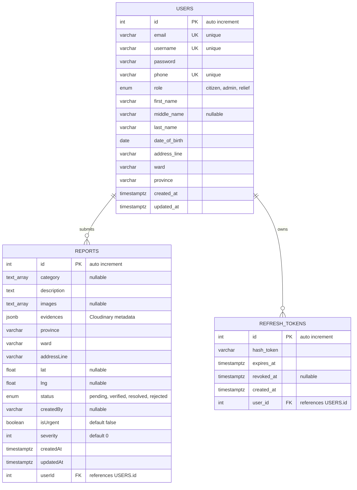

```mermaid
erDiagram

    USERS ||--o{ REPORTS : submits
    USERS ||--o{ REFRESH_TOKENS : owns

    USERS {
        int id PK "auto increment"
        varchar email UK "unique"
        varchar username UK "unique"
        varchar password
        varchar phone UK "unique"
        enum role "citizen, admin, relief"
        varchar first_name
        varchar middle_name "nullable"
        varchar last_name
        date date_of_birth
        varchar address_line
        varchar ward
        varchar province
        timestamptz created_at
        timestamptz updated_at
    }

    REPORTS {
        int id PK "auto increment"
        text_array category "nullable"
        text description
        text_array images "nullable"
        jsonb evidences "Cloudinary metadata"
        varchar province
        varchar ward
        varchar addressLine
        float lat "nullable"
        float lng "nullable"
        enum status "pending, verified, resolved, rejected"
        varchar createdBy "nullable"
        boolean isUrgent "default false"
        int severity "default 0"
        timestamptz createdAt
        timestamptz updatedAt
        int userId FK "references USERS.id"
    }

    REFRESH_TOKENS {
        int id PK "auto increment"
        varchar hash_token
        timestamptz expires_at
        timestamptz revoked_at "nullable"
        timestamptz created_at
        int user_id FK "references USERS.id"
    }
```
