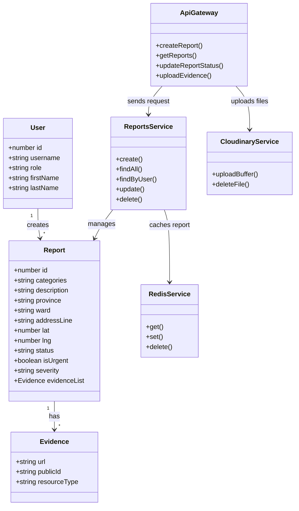

```mermaid
classDiagram

    class User {
        +number id
        +string username
        +string role
        +string firstName
        +string lastName
    }

    class Report {
        +number id
        +string categories
        +string description
        +string province
        +string ward
        +string addressLine
        +number lat
        +number lng
        +string status
        +boolean isUrgent
        +string severity
        +Evidence evidenceList
    }

    class Evidence {
        +string url
        +string publicId
        +string resourceType
    }

    class ApiGateway {
        +createReport()
        +getReports()
        +updateReportStatus()
        +uploadEvidence()
    }

    class ReportsService {
        +create()
        +findAll()
        +findByUser()
        +update()
        +delete()
    }

    class CloudinaryService {
        +uploadBuffer()
        +deleteFile()
    }

    class RedisService {
        +get()
        +set()
        +delete()
    }

    User "1" --> "*" Report : creates
    Report "1" --> "*" Evidence : has
    ApiGateway --> ReportsService : sends request
    ApiGateway --> CloudinaryService : uploads files
    ReportsService --> RedisService : caches report
    ReportsService --> Report : manages
```
