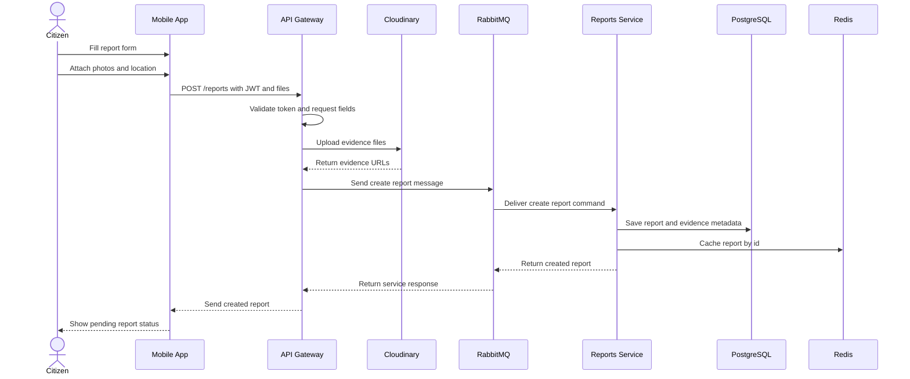

```mermaid
sequenceDiagram
    actor Citizen
    participant Mobile as Mobile App
    participant Gateway as API Gateway
    participant Cloudinary as Cloudinary
    participant MQ as RabbitMQ
    participant Reports as Reports Service
    participant DB as PostgreSQL
    participant Cache as Redis

    Citizen->>Mobile: Fill report form
    Citizen->>Mobile: Attach photos and location
    Mobile->>Gateway: POST /reports with JWT and files
    Gateway->>Gateway: Validate token and request fields
    Gateway->>Cloudinary: Upload evidence files
    Cloudinary-->>Gateway: Return evidence URLs
    Gateway->>MQ: Send create report message
    MQ->>Reports: Deliver create report command
    Reports->>DB: Save report and evidence metadata
    Reports->>Cache: Cache report by id
    Reports-->>MQ: Return created report
    MQ-->>Gateway: Return service response
    Gateway-->>Mobile: Send created report
    Mobile-->>Citizen: Show pending report status
```
