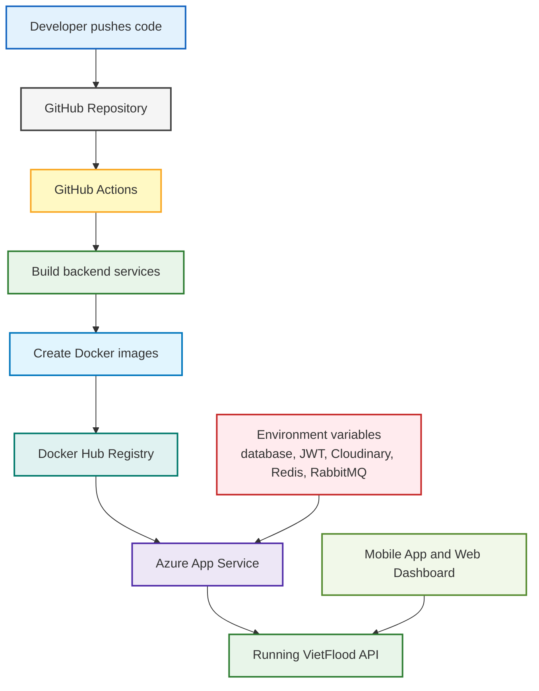

```mermaid
flowchart TD

    Developer["Developer pushes code"]
    GitHub["GitHub Repository"]
    Actions["GitHub Actions"]
    Build["Build backend services"]
    Docker["Create Docker images"]
    Registry["Docker Hub Registry"]
    Azure["Azure App Service"]
    Env["Environment variables<br/>database, JWT, Cloudinary, Redis, RabbitMQ"]
    App["Running VietFlood API"]
    Clients["Mobile App and Web Dashboard"]

    Developer --> GitHub
    GitHub --> Actions
    Actions --> Build
    Build --> Docker
    Docker --> Registry
    Registry --> Azure
    Env --> Azure
    Azure --> App
    Clients --> App

    style Developer fill:#e3f2fd,stroke:#1565c0,stroke-width:2px
    style GitHub fill:#f5f5f5,stroke:#424242,stroke-width:2px
    style Actions fill:#fff9c4,stroke:#f9a825,stroke-width:2px
    style Build fill:#e8f5e9,stroke:#2e7d32,stroke-width:2px
    style Docker fill:#e1f5fe,stroke:#0277bd,stroke-width:2px
    style Registry fill:#e0f2f1,stroke:#00796b,stroke-width:2px
    style Azure fill:#ede7f6,stroke:#512da8,stroke-width:2px
    style Env fill:#ffebee,stroke:#c62828,stroke-width:2px
    style App fill:#e8f5e9,stroke:#2e7d32,stroke-width:2px
    style Clients fill:#f1f8e9,stroke:#558b2f,stroke-width:2px
```
