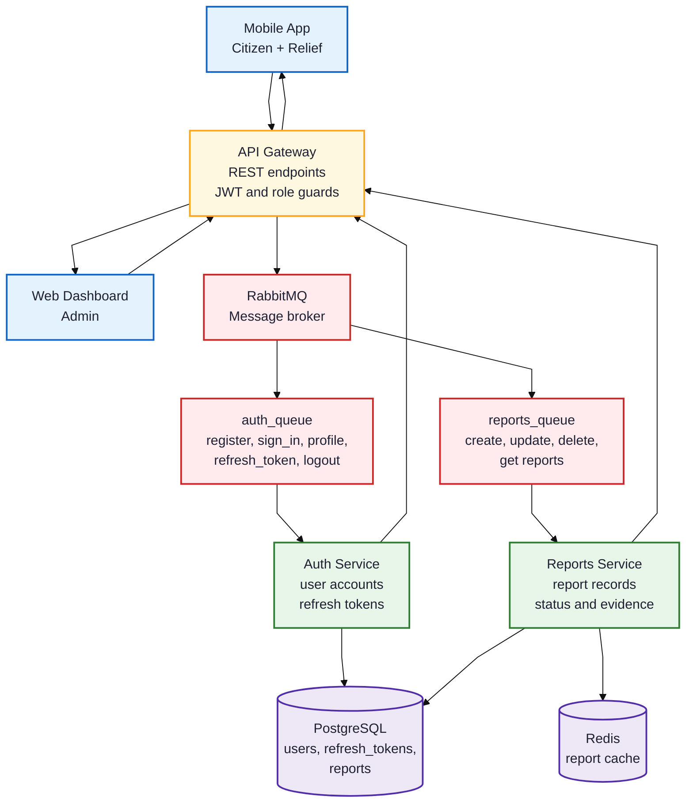

```mermaid
%%{init: {
  "theme": "base",
  "themeVariables": {
    "background": "#ffffff",
    "primaryTextColor": "#202033",
    "primaryBorderColor": "#202033",
    "lineColor": "#111111",
    "fontFamily": "Inter, Arial, sans-serif"
  },
  "flowchart": {
    "htmlLabels": true,
    "curve": "linear",
    "nodeSpacing": 60,
    "rankSpacing": 70
  }
}}%%

flowchart TD

    Mobile["Mobile App<br/>Citizen + Relief"]
    Web["Web Dashboard<br/>Admin"]
    Gateway["API Gateway<br/>REST endpoints<br/>JWT and role guards"]

    Rabbit["RabbitMQ<br/>Message broker"]

    AuthQueue["auth_queue<br/>register, sign_in, profile,<br/>refresh_token, logout"]
    ReportsQueue["reports_queue<br/>create, update, delete,<br/>get reports"]

    AuthService["Auth Service<br/>user accounts<br/>refresh tokens"]
    ReportsService["Reports Service<br/>report records<br/>status and evidence"]

    Postgres[("PostgreSQL<br/>users, refresh_tokens,<br/>reports")]
    Redis[("Redis<br/>report cache")]

    Mobile --> Gateway
    Web --> Gateway

    Gateway --> Rabbit
    Rabbit --> AuthQueue
    Rabbit --> ReportsQueue

    AuthQueue --> AuthService
    ReportsQueue --> ReportsService

    AuthService --> Postgres
    ReportsService --> Postgres
    ReportsService --> Redis

    AuthService --> Gateway
    ReportsService --> Gateway
    Gateway --> Mobile
    Gateway --> Web

    classDef client fill:#e3f2fd,stroke:#1565c0,stroke-width:2px,color:#202033;
    classDef gateway fill:#fff8e1,stroke:#f9a825,stroke-width:2px,color:#202033;
    classDef broker fill:#ffebee,stroke:#c62828,stroke-width:2px,color:#202033;
    classDef service fill:#e8f5e9,stroke:#2e7d32,stroke-width:2px,color:#202033;
    classDef data fill:#ede7f6,stroke:#512da8,stroke-width:2px,color:#202033;

    class Mobile,Web client;
    class Gateway gateway;
    class Rabbit,AuthQueue,ReportsQueue broker;
    class AuthService,ReportsService service;
    class Postgres,Redis data;
```

