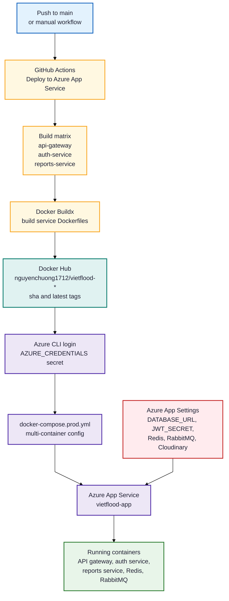

```mermaid
%%{init: {
  "theme": "base",
  "themeVariables": {
    "background": "#ffffff",
    "primaryTextColor": "#202033",
    "primaryBorderColor": "#202033",
    "lineColor": "#111111",
    "fontFamily": "Inter, Arial, sans-serif"
  },
  "flowchart": {
    "htmlLabels": true,
    "curve": "linear",
    "nodeSpacing": 55,
    "rankSpacing": 70
  }
}}%%

flowchart TD

    Push["Push to main<br/>or manual workflow"]
    Actions["GitHub Actions<br/>Deploy to Azure App Service"]
    Matrix["Build matrix<br/>api-gateway<br/>auth-service<br/>reports-service"]
    Buildx["Docker Buildx<br/>build service Dockerfiles"]
    DockerHub["Docker Hub<br/>nguyenchuong1712/vietflood-*<br/>sha and latest tags"]
    AzureLogin["Azure CLI login<br/>AZURE_CREDENTIALS secret"]
    Compose["docker-compose.prod.yml<br/>multi-container config"]
    AppService["Azure App Service<br/>vietflood-app"]
    Runtime["Running containers<br/>API gateway, auth service,<br/>reports service, Redis, RabbitMQ"]
    Env["Azure App Settings<br/>DATABASE_URL, JWT_SECRET,<br/>Redis, RabbitMQ, Cloudinary"]

    Push --> Actions
    Actions --> Matrix
    Matrix --> Buildx
    Buildx --> DockerHub
    DockerHub --> AzureLogin
    AzureLogin --> Compose
    Compose --> AppService
    Env --> AppService
    AppService --> Runtime

    classDef source fill:#e3f2fd,stroke:#1565c0,stroke-width:2px,color:#202033;
    classDef ci fill:#fff8e1,stroke:#f9a825,stroke-width:2px,color:#202033;
    classDef registry fill:#e0f2f1,stroke:#00796b,stroke-width:2px,color:#202033;
    classDef deploy fill:#ede7f6,stroke:#512da8,stroke-width:2px,color:#202033;
    classDef runtime fill:#e8f5e9,stroke:#2e7d32,stroke-width:2px,color:#202033;
    classDef config fill:#ffebee,stroke:#c62828,stroke-width:2px,color:#202033;

    class Push source;
    class Actions,Matrix,Buildx ci;
    class DockerHub registry;
    class AzureLogin,Compose,AppService deploy;
    class Runtime runtime;
    class Env config;
```

