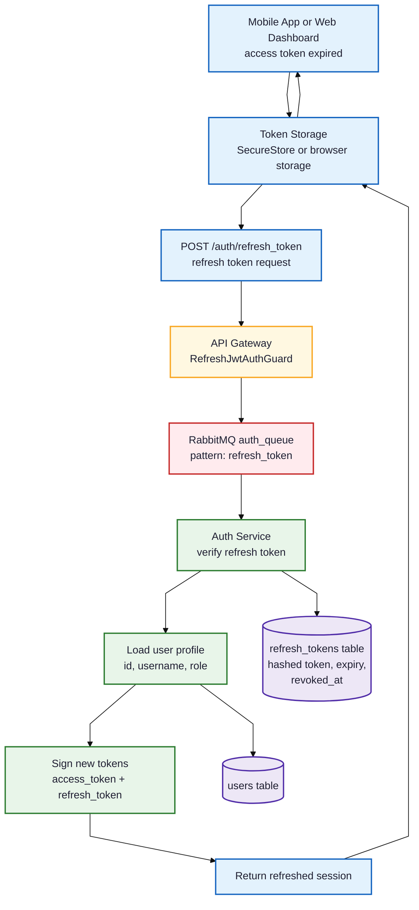

```mermaid
%%{init: {
  "theme": "base",
  "themeVariables": {
    "background": "#ffffff",
    "primaryTextColor": "#202033",
    "primaryBorderColor": "#202033",
    "lineColor": "#111111",
    "fontFamily": "Inter, Arial, sans-serif"
  },
  "flowchart": {
    "htmlLabels": true,
    "curve": "linear",
    "nodeSpacing": 55,
    "rankSpacing": 70
  }
}}%%

flowchart TD

    Client["Mobile App or Web Dashboard<br/>access token expired"]
    Storage["Token Storage<br/>SecureStore or browser storage"]
    RefreshEndpoint["POST /auth/refresh_token<br/>refresh token request"]
    Gateway["API Gateway<br/>RefreshJwtAuthGuard"]
    AuthQueue["RabbitMQ auth_queue<br/>pattern: refresh_token"]
    AuthService["Auth Service<br/>verify refresh token"]
    UserLookup["Load user profile<br/>id, username, role"]
    SignTokens["Sign new tokens<br/>access_token + refresh_token"]
    Response["Return refreshed session"]

    RefreshTable[("refresh_tokens table<br/>hashed token, expiry,<br/>revoked_at")]
    UsersTable[("users table")]

    Client --> Storage
    Storage --> RefreshEndpoint
    RefreshEndpoint --> Gateway
    Gateway --> AuthQueue
    AuthQueue --> AuthService

    AuthService --> RefreshTable
    AuthService --> UserLookup
    UserLookup --> UsersTable
    UserLookup --> SignTokens
    SignTokens --> Response
    Response --> Storage
    Storage --> Client

    classDef client fill:#e3f2fd,stroke:#1565c0,stroke-width:2px,color:#202033;
    classDef gateway fill:#fff8e1,stroke:#f9a825,stroke-width:2px,color:#202033;
    classDef broker fill:#ffebee,stroke:#c62828,stroke-width:2px,color:#202033;
    classDef service fill:#e8f5e9,stroke:#2e7d32,stroke-width:2px,color:#202033;
    classDef data fill:#ede7f6,stroke:#512da8,stroke-width:2px,color:#202033;

    class Client,Storage,RefreshEndpoint,Response client;
    class Gateway gateway;
    class AuthQueue broker;
    class AuthService,UserLookup,SignTokens service;
    class RefreshTable,UsersTable data;
```

