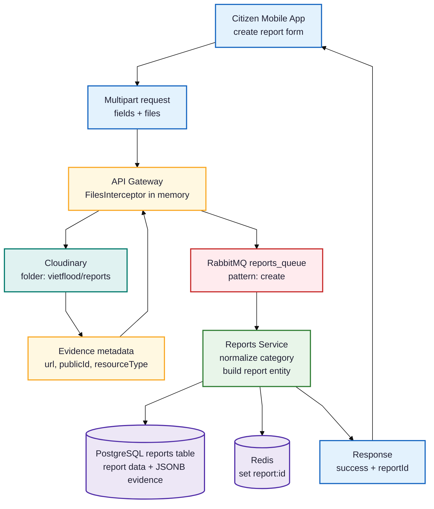

```mermaid
%%{init: {
  "theme": "base",
  "themeVariables": {
    "background": "#ffffff",
    "primaryTextColor": "#202033",
    "primaryBorderColor": "#202033",
    "lineColor": "#111111",
    "fontFamily": "Inter, Arial, sans-serif"
  },
  "flowchart": {
    "htmlLabels": true,
    "curve": "linear",
    "nodeSpacing": 55,
    "rankSpacing": 70
  }
}}%%

flowchart TD

    Citizen["Citizen Mobile App<br/>create report form"]
    Multipart["Multipart request<br/>fields + files"]
    Gateway["API Gateway<br/>FilesInterceptor in memory"]
    Cloudinary["Cloudinary<br/>folder: vietflood/reports"]
    Evidence["Evidence metadata<br/>url, publicId, resourceType"]
    ReportsQueue["RabbitMQ reports_queue<br/>pattern: create"]
    ReportsService["Reports Service<br/>normalize category<br/>build report entity"]
    Postgres[("PostgreSQL reports table<br/>report data + JSONB evidence")]
    Redis[("Redis<br/>set report:id")]
    Result["Response<br/>success + reportId"]

    Citizen --> Multipart
    Multipart --> Gateway
    Gateway --> Cloudinary
    Cloudinary --> Evidence
    Evidence --> Gateway
    Gateway --> ReportsQueue
    ReportsQueue --> ReportsService
    ReportsService --> Postgres
    ReportsService --> Redis
    ReportsService --> Result
    Result --> Citizen

    classDef client fill:#e3f2fd,stroke:#1565c0,stroke-width:2px,color:#202033;
    classDef gateway fill:#fff8e1,stroke:#f9a825,stroke-width:2px,color:#202033;
    classDef external fill:#e0f2f1,stroke:#00796b,stroke-width:2px,color:#202033;
    classDef broker fill:#ffebee,stroke:#c62828,stroke-width:2px,color:#202033;
    classDef service fill:#e8f5e9,stroke:#2e7d32,stroke-width:2px,color:#202033;
    classDef data fill:#ede7f6,stroke:#512da8,stroke-width:2px,color:#202033;

    class Citizen,Multipart,Result client;
    class Gateway,Evidence gateway;
    class Cloudinary external;
    class ReportsQueue broker;
    class ReportsService service;
    class Postgres,Redis data;
```

