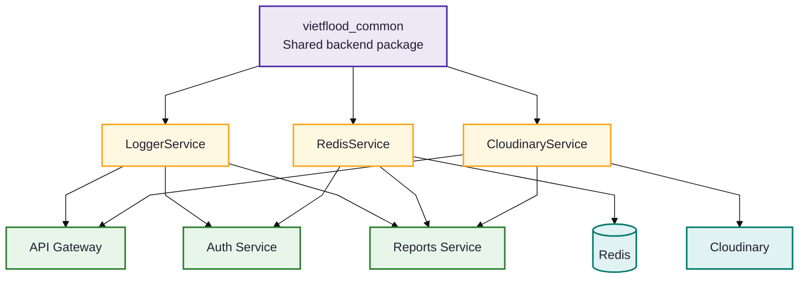

```mermaid
%%{init: {
  "theme": "base",
  "themeVariables": {
    "background": "#ffffff",
    "primaryTextColor": "#202033",
    "primaryBorderColor": "#202033",
    "lineColor": "#111111",
    "fontFamily": "Inter, Arial, sans-serif"
  },
  "flowchart": {
    "htmlLabels": true,
    "curve": "linear",
    "nodeSpacing": 65,
    "rankSpacing": 75
  }
}}%%

flowchart TD

    Common["vietflood_common<br/>Shared backend package"]

    Logger["LoggerService"]
    RedisHelper["RedisService"]
    CloudinaryHelper["CloudinaryService"]

    Gateway["API Gateway"]
    AuthService["Auth Service"]
    ReportsService["Reports Service"]

    Redis[("Redis")]
    Cloudinary["Cloudinary"]

    Common --> Logger
    Common --> RedisHelper
    Common --> CloudinaryHelper

    Logger --> Gateway
    Logger --> AuthService
    Logger --> ReportsService

    RedisHelper --> AuthService
    RedisHelper --> ReportsService
    RedisHelper --> Redis

    CloudinaryHelper --> Gateway
    CloudinaryHelper --> ReportsService
    CloudinaryHelper --> Cloudinary

    classDef shared fill:#ede7f6,stroke:#512da8,stroke-width:2px,color:#202033;
    classDef module fill:#fff8e1,stroke:#f9a825,stroke-width:2px,color:#202033;
    classDef service fill:#e8f5e9,stroke:#2e7d32,stroke-width:2px,color:#202033;
    classDef external fill:#e0f2f1,stroke:#00796b,stroke-width:2px,color:#202033;

    class Common shared;
    class Logger,RedisHelper,CloudinaryHelper module;
    class Gateway,AuthService,ReportsService service;
    class Redis,Cloudinary external;
```
