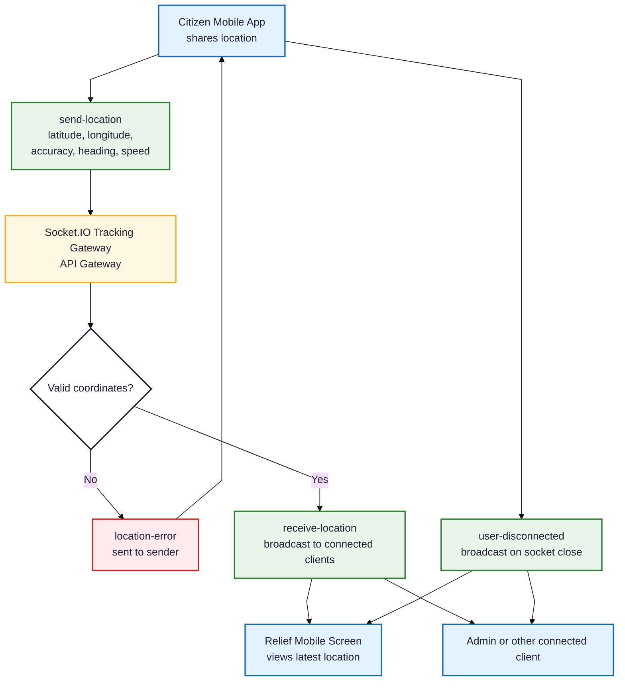

```mermaid
%%{init: {
  "theme": "base",
  "themeVariables": {
    "background": "#ffffff",
    "primaryTextColor": "#202033",
    "primaryBorderColor": "#202033",
    "lineColor": "#111111",
    "fontFamily": "Inter, Arial, sans-serif"
  },
  "flowchart": {
    "htmlLabels": true,
    "curve": "linear",
    "nodeSpacing": 55,
    "rankSpacing": 70
  }
}}%%

flowchart TD

    Citizen["Citizen Mobile App<br/>shares location"]
    Payload["send-location<br/>latitude, longitude,<br/>accuracy, heading, speed"]
    Gateway["Socket.IO Tracking Gateway<br/>API Gateway"]
    Validate{"Valid coordinates?"}
    Error["location-error<br/>sent to sender"]
    Broadcast["receive-location<br/>broadcast to connected clients"]
    Relief["Relief Mobile Screen<br/>views latest location"]
    Admin["Admin or other connected client"]
    Disconnect["user-disconnected<br/>broadcast on socket close"]

    Citizen --> Payload
    Payload --> Gateway
    Gateway --> Validate
    Validate -- "No" --> Error
    Error --> Citizen
    Validate -- "Yes" --> Broadcast
    Broadcast --> Relief
    Broadcast --> Admin
    Citizen --> Disconnect
    Disconnect --> Relief
    Disconnect --> Admin

    classDef client fill:#e3f2fd,stroke:#1565c0,stroke-width:2px,color:#202033;
    classDef gateway fill:#fff8e1,stroke:#f9a825,stroke-width:2px,color:#202033;
    classDef decision fill:#ffffff,stroke:#202033,stroke-width:2px,color:#202033;
    classDef event fill:#e8f5e9,stroke:#2e7d32,stroke-width:2px,color:#202033;
    classDef error fill:#ffebee,stroke:#c62828,stroke-width:2px,color:#202033;

    class Citizen,Relief,Admin client;
    class Gateway gateway;
    class Validate decision;
    class Payload,Broadcast,Disconnect event;
    class Error error;
```

