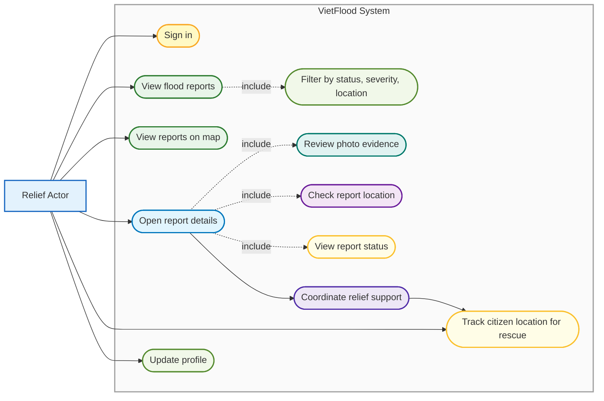

```mermaid
flowchart LR

    Relief["Relief Actor"]

    subgraph VietFlood["VietFlood System"]
        SignIn([Sign in])
        ViewReports([View flood reports])
        FilterReports([Filter by status, severity, location])
        ViewMap([View reports on map])
        ReviewDetails([Open report details])
        ReviewEvidence([Review photo evidence])
        CheckLocation([Check report location])
        ViewStatus([View report status])
        CoordinateSupport([Coordinate relief support])
        TrackCitizen([Track citizen location for rescue])
        UpdateProfile([Update profile])
    end

    Relief --> SignIn
    Relief --> ViewReports
    Relief --> ViewMap
    Relief --> ReviewDetails
    Relief --> TrackCitizen
    Relief --> UpdateProfile

    ViewReports -. "include" .-> FilterReports
    ReviewDetails -. "include" .-> ReviewEvidence
    ReviewDetails -. "include" .-> CheckLocation
    ReviewDetails -. "include" .-> ViewStatus
    ReviewDetails --> CoordinateSupport
    CoordinateSupport --> TrackCitizen

    style Relief fill:#e3f2fd,stroke:#1565c0,stroke-width:2px
    style VietFlood fill:#fafafa,stroke:#9e9e9e,stroke-width:2px
    style SignIn fill:#fff9c4,stroke:#f9a825,stroke-width:2px
    style ViewReports fill:#e8f5e9,stroke:#2e7d32,stroke-width:2px
    style FilterReports fill:#f1f8e9,stroke:#558b2f,stroke-width:2px
    style ViewMap fill:#e8f5e9,stroke:#2e7d32,stroke-width:2px
    style ReviewDetails fill:#e1f5fe,stroke:#0277bd,stroke-width:2px
    style ReviewEvidence fill:#e0f2f1,stroke:#00796b,stroke-width:2px
    style CheckLocation fill:#f3e5f5,stroke:#6a1b9a,stroke-width:2px
    style ViewStatus fill:#fffde7,stroke:#fbc02d,stroke-width:2px
    style CoordinateSupport fill:#ede7f6,stroke:#512da8,stroke-width:2px
    style TrackCitizen fill:#fffde7,stroke:#fbc02d,stroke-width:2px
    style UpdateProfile fill:#f1f8e9,stroke:#558b2f,stroke-width:2px
```
