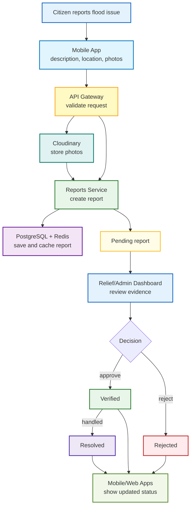

```mermaid
flowchart TD

    Citizen["Citizen reports flood issue"]
    Mobile["Mobile App<br/>description, location, photos"]
    Gateway["API Gateway<br/>validate request"]
    Evidence["Cloudinary<br/>store photos"]
    Reports["Reports Service<br/>create report"]
    Database["PostgreSQL + Redis<br/>save and cache report"]
    Pending["Pending report"]
    Dashboard["Relief/Admin Dashboard<br/>review evidence"]
    Decision{"Decision"}
    Verified["Verified"]
    Rejected["Rejected"]
    Resolved["Resolved"]
    Apps["Mobile/Web Apps<br/>show updated status"]

    Citizen --> Mobile
    Mobile --> Gateway
    Gateway --> Evidence
    Gateway --> Reports
    Evidence --> Reports
    Reports --> Database
    Reports --> Pending
    Pending --> Dashboard
    Dashboard --> Decision
    Decision -- "approve" --> Verified
    Decision -- "reject" --> Rejected
    Verified -- "handled" --> Resolved
    Verified --> Apps
    Rejected --> Apps
    Resolved --> Apps

    style Citizen fill:#e3f2fd,stroke:#1565c0,stroke-width:2px
    style Mobile fill:#e1f5fe,stroke:#0277bd,stroke-width:2px
    style Gateway fill:#fff9c4,stroke:#f9a825,stroke-width:2px
    style Evidence fill:#e0f2f1,stroke:#00796b,stroke-width:2px
    style Reports fill:#e8f5e9,stroke:#2e7d32,stroke-width:2px
    style Database fill:#f3e5f5,stroke:#6a1b9a,stroke-width:2px
    style Pending fill:#fffde7,stroke:#fbc02d,stroke-width:2px
    style Dashboard fill:#e3f2fd,stroke:#1565c0,stroke-width:2px
    style Verified fill:#e8f5e9,stroke:#2e7d32,stroke-width:2px
    style Rejected fill:#ffebee,stroke:#c62828,stroke-width:2px
    style Resolved fill:#ede7f6,stroke:#512da8,stroke-width:2px
    style Apps fill:#f1f8e9,stroke:#558b2f,stroke-width:2px
```
